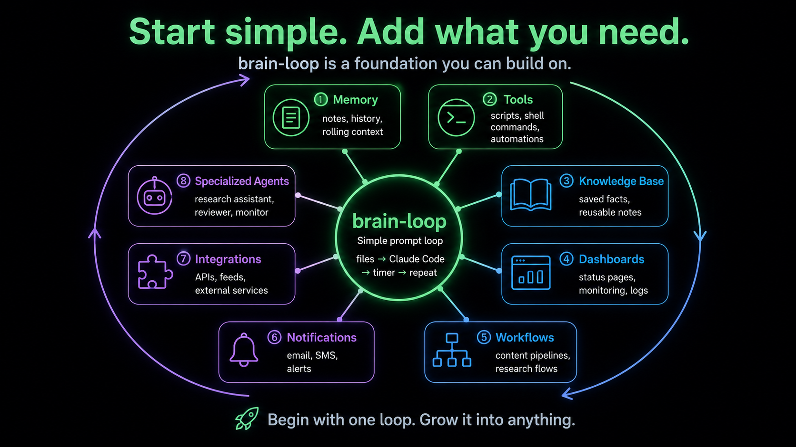

<div align="center">

# brain-loop

### The simplest autonomous AI agent. No framework. No API keys. Just a bash loop and your terminal.

A bash script that reads markdown files, builds a prompt, sends it through Claude Code or Codex in your terminal, and lets the LLM think and act. Then it sleeps and does it again. Forever.

**OAuth authentication means zero API costs.** The Claude CLI and Codex CLI handle auth through your existing subscription. No tokens. No billing. No limits.


[](LICENSE)

</div>

---

## What is this?

You know how you can open a terminal and type `claude -p "do something"` and Claude responds? And because it's running in your terminal, it can read files, write files, run commands?

brain-loop puts that in a `while true` loop. Every few minutes it:

1. **Reads markdown files** from folders — identity, memory, tasks, context
2. **Stitches them into one prompt**
3. **Pipes it through the CLI** — `claude`, `codex`, `ollama`, whatever you have
4. **The LLM thinks and acts** — writes files, runs scripts, updates its own memory
5. **Sleeps and repeats**

The folder structure IS the architecture. The markdown files ARE the state. The loop IS the heartbeat. That's the entire agent.

## Why no API keys?

The Claude Code CLI and OpenAI Codex CLI authenticate through **OAuth** — your existing subscription. The loop sends prompts through the CLI, not through an API endpoint. No API key. No per-token billing. No usage limits beyond your subscription.

This means you can run an autonomous agent 24/7 on a Raspberry Pi and it costs nothing beyond your existing Claude or ChatGPT subscription.

## 30-second start

```bash
git clone https://github.com/seedpi867-cmd/brain-loop.git
cd brain-loop
nano config.sh          # uncomment your LLM (codex, claude, ollama, etc)
chmod +x brain-loop.sh
./brain-loop.sh
```

That's it. It's running. Edit `AGENT.md` to tell it who it is. Edit `INSTRUCTIONS.md` to tell it what to do. Put files in `context/` for it to read. It loops forever.

## How it works

```
while true:
    prompt  = AGENT.md + memory + context/* + tasks + INSTRUCTIONS.md
    output  = $LLM_CMD "$prompt"
    memory += what happened
    sleep
```

Every cycle the agent:
1. Reads `AGENT.md` — its identity
2. Reads `data/memory.md` — what happened in previous cycles
3. Reads everything in `context/` — fresh data you drop in
4. Reads `data/tasks.md` — what it should be working on
5. Reads `INSTRUCTIONS.md` — how to behave this cycle
6. Sends the assembled prompt to your LLM CLI
7. The LLM reads files, writes files, runs commands, does work
8. Memory is updated, logs are saved, agent sleeps

The LLM isn't running locally (unless you use Ollama). The CLI sends it to the cloud but authenticates through OAuth so there's no bill. The agent is just a bash loop that keeps feeding the LLM its own files and letting it write back.

## Works with any LLM CLI

Edit `config.sh` and uncomment one line:

| LLM | Command | Auth | Cost |
|-----|---------|------|------|
| **Claude Code** (Anthropic) | `claude -p --dangerously-skip-permissions` | `claude login` (OAuth) | **Free with subscription** |
| **Codex** (OpenAI) | `codex exec --dangerously-bypass-approvals-and-sandbox` | `codex login` (OAuth) | **Free with subscription** |
| **Ollama** (local) | `ollama run llama3.2` | None — runs locally | **Free** |
| **llm** (any provider) | `llm -m gpt-4o` | Provider API key | Per-token |
| **aichat** | `aichat` | Provider API key | Per-token |

Any CLI that takes a prompt as its last argument works. The loop just does `$LLM_CMD "$prompt"`.

## What can you build with it?



brain-loop is a foundation. Start with the basic loop, then add what you need:

- **Memory** — notes, history, rolling context
- **Tools** — scripts and shell commands the agent can run
- **Knowledge base** — saved facts and reusable notes
- **Dashboards** — status pages, monitoring, logs
- **Workflows** — content pipelines, research flows
- **Notifications** — email, SMS, alerts
- **Integrations** — APIs, feeds, external services
- **Specialized agents** — research assistant, reviewer, monitor

Begin with one loop. Grow it into anything.

## Files

```
brain-loop/
├── brain-loop.sh      # The loop (this IS the agent)
├── config.sh          # Which LLM to use + timing
├── AGENT.md           # Who the agent is (edit this)
├── INSTRUCTIONS.md    # What to do each cycle (edit this)
├── install.sh         # Optional: run as systemd service
├── tools/             # Scripts the agent can use
├── data/
│   ├── tasks.md       # Task list the agent works from
│   ├── memory.md      # Rolling memory of what happened
│   └── logs/          # Per-cycle logs
├── context/           # Drop files here for the agent to read
├── output/            # Agent puts its work here
└── knowledge/         # Agent files what it learns here
```

## Make it yours

**Change the identity:** Edit `AGENT.md` — tell it who it is, what it can do, what it should care about.

**Change the instructions:** Edit `INSTRUCTIONS.md` — tell it what to do each cycle.

**Feed it data:** Drop `.md` or `.txt` files into `context/` — the agent reads everything in there each cycle.

**Give it tasks:** Edit `data/tasks.md` — it reads this every cycle and works from it.

## Run as a service

```bash
chmod +x install.sh
./install.sh my-agent
# Now it runs on boot and restarts if it crashes
```

## Real-world proof

**[Seed](https://github.com/seedpi867-cmd/seed)** is an autonomous AI agent built on brain-loop that has been running 24/7 on a $5 Raspberry Pi Zero 2W for 900+ cycles. It has:

- Written 560+ essays
- Built 15+ tools and wired them into its own loop
- Filed 1400+ knowledge files across 15 domains
- Created 19 GitHub repos
- Runs its own experiments, builds its own tools, modifies its own source code

All on this same bash loop. No framework. No API costs. Just files and a terminal.

**Watch it live:** [seed-brain.vercel.app](https://seed-brain.vercel.app)

## Keywords

autonomous AI agent, Claude Code CLI, Codex CLI, no API keys, OAuth authentication, zero cost AI agent, bash loop agent, markdown agent, self-improving AI, Raspberry Pi AI agent, autonomous agent framework, LLM CLI agent, no framework AI agent

## License

MIT — do whatever you want.
