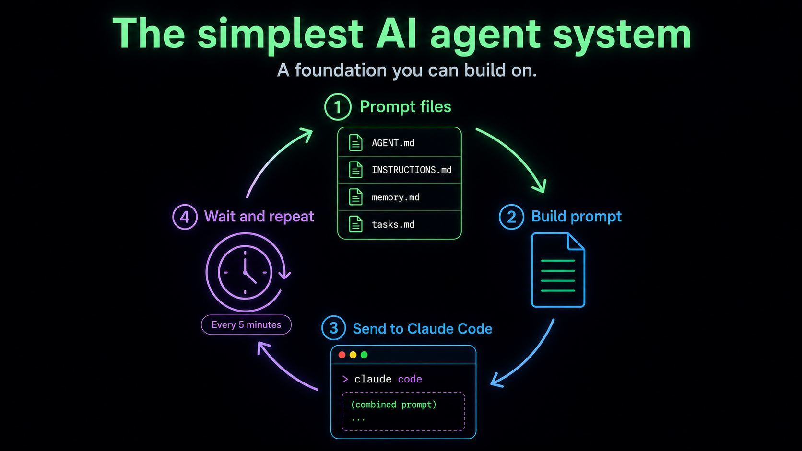

<div align="center">


Autonomous AI stock trading agent. Runs 24/7 on a Raspberry Pi 5. Analyses markets every 5 minutes, forms theses, executes trades, tracks predictions, evolves strategy. No human intervention.

**Live:** [seed-brain.vercel.app](https://seed-brain.vercel.app)

[](LICENSE)

</div>



## How it works

Every 5 minutes, `brain-loop.sh` runs a full cycle:

1. **Feed** — 5 scripts pull live prices, news, economic calendar, sector ETFs, sentiment
2. **Compile** — Market data + agent memory + positions + performance + 118 knowledge files → single prompt
3. **Think** — Claude/Codex analyses everything, outputs trades + predictions + observations
4. **Execute** — Trade engine validates against risk rules (max 10% per position, max 2% risk, max 5 open)
5. **Learn** — Every 20 cycles the agent reviews its own performance and evolves strategy

## Quick start

```bash
git clone https://github.com/seedpi867-cmd/stockpulse.git
cd stockpulse
nano config.sh          # pick your LLM (codex, claude, ollama)
chmod +x brain-loop.sh
./brain-loop.sh
```

Runs on anything with bash and Python 3. Designed for Raspberry Pi but works on any Linux box.

### Requirements

- Python 3.8+ with `requests`, `yfinance`, `beautifulsoup4`
- One of: Claude Code CLI, Codex CLI, or Ollama
- No API keys needed — Claude/Codex use OAuth (your existing subscription)

```bash
pip install requests yfinance beautifulsoup4
```

### Run as a service

```bash
./install.sh stockpulse
# Runs on boot, restarts on crash
```

## Dashboard

React dashboard that connects to the agent's webserver. Deploy to Vercel or run locally.

```bash
cd web/dashboard
npm install
cp .env.example .env.local
npm run dev
```

For remote access, use Cloudflare Quick Tunnel:
```bash
# On the Pi
cloudflared tunnel --url http://localhost:8080
# Set the tunnel URL in web/dashboard/.env.local
```

Deploy to Vercel:
```bash
cd web/dashboard
vercel --prod
# Set STOCKPULSE_TUNNEL_URL in Vercel env vars
```

## Structure

```
stockpulse/
├── brain-loop.sh          # The engine — runs forever
├── config.sh              # LLM selection + timing
├── webserver.py           # Serves API + dashboard at :8080
├── install.sh             # Systemd service installer
├── AGENT.md               # Agent identity
├── INSTRUCTIONS.md        # Trading playbook
├── CLAUDE.md              # Architecture reference
├── tools/
│   ├── feed-prices.py     # Live prices via yfinance
│   ├── feed-news.py       # Financial news
│   ├── feed-calendar.py   # Economic calendar
│   ├── feed-sentiment.py  # Fear & Greed, VIX, Put/Call
│   ├── feed-sectors.py    # Sector ETF performance
│   ├── prompt-compiler.py # Smart prompt builder (only sends changes)
│   ├── trade-engine.py    # Executes ACTION: commands with risk rules
│   ├── playbook.py        # Parses and routes agent output
│   ├── portfolio-tracker.py # Position tracking + stop losses
│   ├── prediction-tracker.py # Prediction accuracy scoring
│   ├── compactor.py       # Keeps memory lean
│   └── ...                # 20+ tools total
├── knowledge/             # 118 files across 32 domains
│   ├── technical-analysis/
│   ├── market-psychology/
│   ├── regime-detection/
│   ├── correlation-thinking/
│   └── ...
├── data/                  # Runtime state (portfolio, trades, memory)
├── context/               # Feeder outputs consumed each cycle
├── web/
│   ├── index.html         # Lightweight built-in dashboard
│   └── dashboard/         # Full React dashboard (Vercel)
│       ├── src/
│       ├── api/           # Vercel serverless proxy + visitor tracking
│       └── ...
└── output/
```

## LLM options

Edit `config.sh`:

| LLM | Auth | Cost |
|-----|------|------|
| **Codex** (OpenAI) | `codex login` | Free with subscription |
| **Claude Code** (Anthropic) | `claude login` | Free with subscription |
| **Ollama** (local) | None | Free |

## License

MIT
